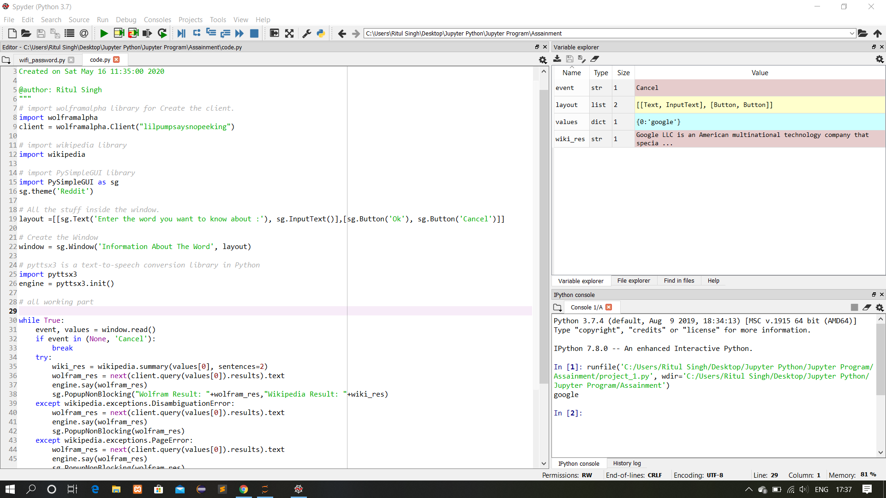
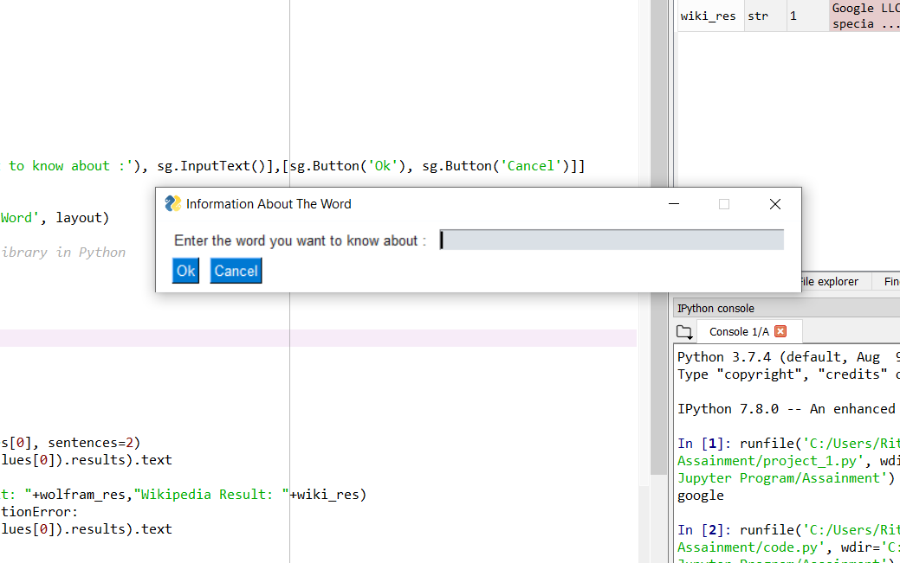
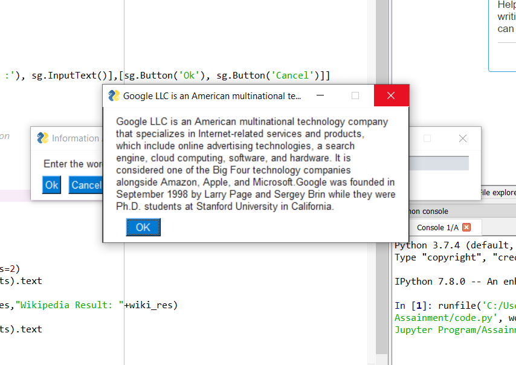

# Python-Word-Search
This project-based on word search and speak a little bit about the word and this program written in python language.
### **First step:** Open the code.py file in your python IDE. Here I am using Spyder IDE.

### Second step:  Run the program.

### Third step: Enter the word you want to search on Wikipedia. Here I search google. Output display in front of you.

